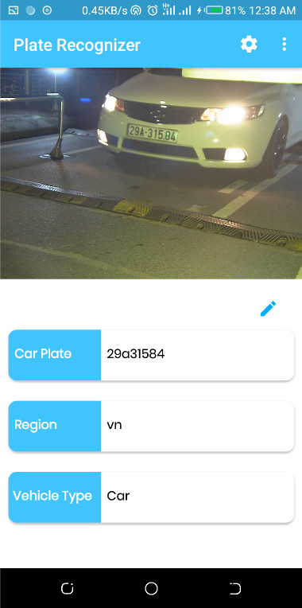

# Automatic License Plate Recognition (ALPR, ANPR) on Mobile App - Android
Get high-accuracy, developer-friendly **automatic license plate recognition** ([ALPR](https://platerecognizer.com/?utm_source=github&amp;utm_medium=website)) or automatic number plate recognition ([ANPR](https://platerecognizer.com/?utm_source=github&amp;utm_medium=website)) on a mobile app in Android!

Our machine-learning software:

- Works on **dark, low-res, blurry images** and tough angles, all vehicle types, etc.  See our full [ALPR results](https://platerecognizer.com/alpr-results/?utm_source=github&amp;utm_medium=website).
- Decodes **license plate** , vehicle type (e.g. SUV, van, pickup truck), [**vehicle make model**](https://platerecognizer.com/vehicle-make-model-recognition-with-color/?utm_source=github&amp;utm_medium=website) (e.g. Honda Accord), color, and orientation. Ignores bumper stickers, car signs, etc.
- Is optimized for all [50 USA States](https://platerecognizer.com/alpr-for-usa/?utm_source=github&amp;utm_medium=website), [India](https://platerecognizer.com/anpr-for-india?utm_source=github&amp;utm_medium=website), [Brazil](https://platerecognizer.com/anpr-for-brazil/?utm_source=github&amp;utm_medium=website) and [**90+ countries worldwide**](https://platerecognizer.com/countries/?utm_source=github&amp;utm_medium=website).

Using this Android Mobile App, you can easily take a photo with your phone camera and the app will decode the license plate seen in the photo.

Sign up for a [**Free Trial**](https://app.platerecognizer.com/accounts/signup/?utm_source=github&amp;utm_medium=website) now (no credit card required) or **learn more** at [https://platerecognizer.com](https://platerecognizer.com/).

## How to Get LPR on Android App

- You need an **API token** from [Plate Recognizer](https://platerecognizer.com/) to use app. Get the [APK package](https://github.com/parkpow/alpr-anpr-android/releases) or build it yourself.
- To **build** the app, we recommand using [Android Studio](https://developer.android.com/studio).

